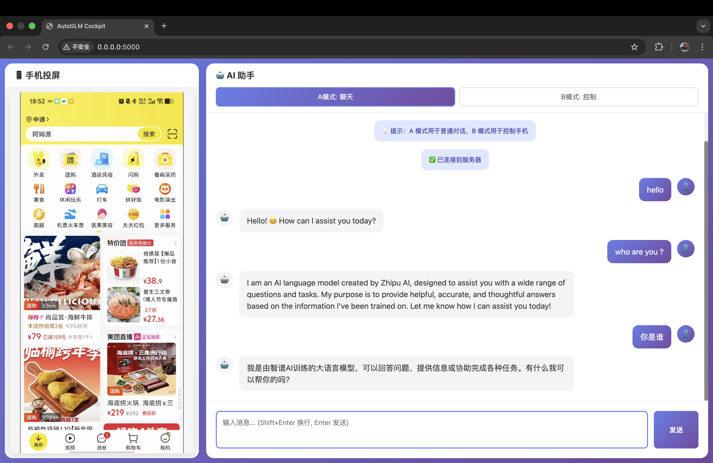
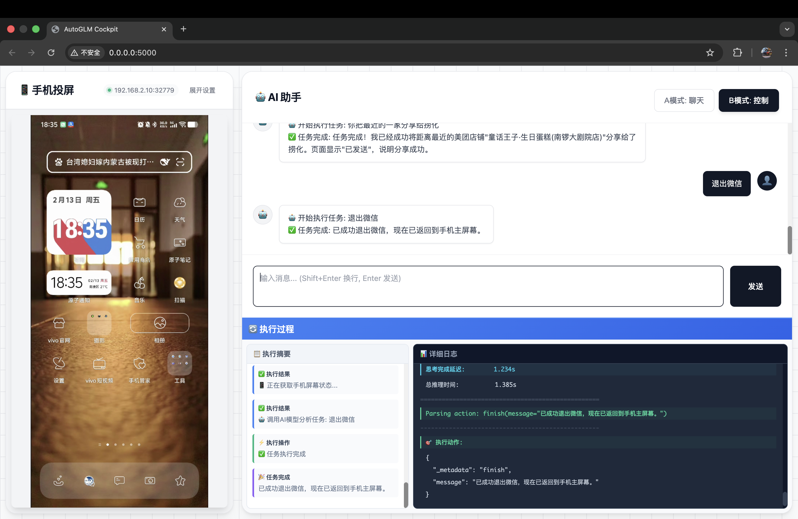

# 🚀 AutoGLM Cockpit Web

<div align="center">

**基于 Web 的智能手机 AI 控制平台**

集成实时投屏 • AI 对话 • 手机智能控制

[English](README_en.md) | [中文](README.md)

[](https://www.python.org/)
[](https://flask.palletsprojects.com/)
[](LICENSE)

[功能特性](#✨-功能特性) • [快速开始](#🚀-快速开始) • [使用指南](#📖-使用指南) • [架构设计](#🏗️-架构设计)

</div>

---

## 📸 产品预览

### 主界面 - 双模式操作


**左侧：** 实时手机投屏 (1080p@60fps)  
**右侧：** AI 智能助手（双模式切换）

### B模式 - 智能控制执行


**上半部分：** 任务对话输入区  
**下半部分：** AutoGLM 实时执行过程可视化

---

## ✨ 功能特性

### 🎯 核心功能

| 功能模块 | 说明 | 技术亮点 |
|---------|------|---------|
| 💬 **A模式 - AI对话** | 基于GLM-4的智能对话系统 | 支持流式输出，实时响应 |
| 🤖 **B模式 - 智能控制** | AutoGLM驱动的手机自动化 | 视觉理解+操作执行，自然语言控制 |
| 📱 **实时投屏** | scrcpy超低延迟视频流 | 1080p分辨率，60fps流畅度 |
| � **无线ADB连接** | 内置配对和连接管理 | 在UI上直接配对，无需命令行 |
| 🔄 **执行可视化** | 实时显示AI思考与操作 | 分步骤展示，过程透明 |

### 🌟 技术亮点

- **🚄 高性能投屏**
  - 基于 scrcpy 原生视频流，延迟 < 100ms
  - 支持 1080p/60fps 高清流畅显示
  - JPEG 高质量编码 + CSS 渲染优化
  - 可折叠控制面板，最大化投屏区域

- **🔌 无线ADB管理**
  - **图形化配对**：在Web界面直接输入配对信息
  - **快速连接**：已配对设备一键连接
  - **智能收起**：连接/投屏成功后自动隐藏控制面板
  - **状态实时显示**：连接状态、设备信息一目了然

- **🧠 双模式 AI 引擎**
  - **A模式**：GLM-4 流式对话，支持多轮交互
  - **B模式**：AutoGLM 视觉智能体，自主手机控制

- **🎨 现代化 Web UI**
  - 极简企业级设计风格（类 SaaS 产品）
  - 纯白悬浮卡片 + 浅灰网格背景
  - 响应式布局，自适应屏幕尺寸
  - WebSocket 实时通信，无刷新交互
  - 细腻的动画和交互反馈

- **🔌 灵活架构**
  - 前后端分离，易于扩展
  - 模块化设计，清晰的代码组织
  - 支持多设备并发（未来扩展）

---

## 🏗️ 架构设计

### 系统架构图

```
┌─────────────────────────────────────────────────────────────┐
│                     浏览器客户端                              │
│  ┌──────────────────┐         ┌──────────────────┐          │
│  │  左侧：手机投屏   │         │  右侧：AI 控制台  │          │
│  │  • scrcpy 视频   │         │  • 模式切换       │          │
│  │  • 实时显示      │         │  • 对话输入       │          │
│  │                  │         │  • 执行过程       │          │
│  └──────────────────┘         └──────────────────┘          │
└────────────┬─────────────────────────┬─────────────────────┘
             │    WebSocket (Socket.IO) │
             │                          │
┌────────────▼──────────────────────────▼─────────────────────┐
│                 Flask Web Server                             │
│  ┌──────────────┐  ┌──────────────┐  ┌──────────────┐      │
│  │ 投屏服务      │  │ A模式 GLM-4  │  │ B模式 AutoGLM│      │
│  │ scrcpy Client│  │ Normal Chat  │  │ Phone Agent  │      │
│  └──────┬───────┘  └──────┬───────┘  └──────┬───────┘      │
│         │                 │                  │               │
│         │ ADB             │ HTTPS            │ HTTP:8080     │
│         │                 │                  │               │
│  ┌──────▼─────────────────▼──────────────────▼──────┐       │
│  │      设备控制层 - Accessibility Service          │       │
│  └──────────────────────┬───────────────────────────┘       │
└─────────────────────────┼─────────────────────────────────────┘
                          │ ADB (投屏) + HTTP (控制)
                          │
              ┌───────────▼───────────┐
              │   Android 手机设备     │
              │  • ADB: 投屏视频流     │
              │  • HTTP:8080 控制接口 │
              │   192.168.2.10       │
              └───────────────────────┘
```

### 数据流详解

1. **投屏流程**（左侧显示）
   ```
   手机屏幕 → scrcpy Server (手机端) 
           → scrcpy Client (服务器) 
           → JPEG 编码 
           → WebSocket 推送 
           → 浏览器显示
   ```

2. **A模式对话流程**
   ```
   用户输入 → Flask 后端 
           → GLM-4 API (流式) 
           → 逐字返回 
           → 浏览器显示
   ```

3. **B模式控制流程** ⭐ 使用 Accessibility Service
   ```
   用户指令 → AutoGLM Agent 
           → HTTP 请求截图 (port:8080)
           → GLM 视觉分析 
           → 生成操作指令
           → HTTP 发送操作 (port:8080)
           → Accessibility Service 执行
           → 反馈结果
   ```

   **Accessibility 优势**：
   - ✅ 支持文本输入（包括中文）
   - ✅ 更稳定的点击和滑动
   - ✅ 无需 ADB 键盘
   - ✅ 原生无障碍服务支持

---

## 📋 系统要求

### 必备环境

- **操作系统**: macOS / Linux / Windows
- **Python**: 3.11 或更高版本
- **ADB**: Android Debug Bridge（用于手机通信）
- **scrcpy**: 手机投屏工具
- **浏览器**: Chrome / Firefox / Safari / Edge（现代浏览器）

### Android 手机要求

- Android 5.0+ (推荐 Android 11+)
- 开启开发者选项 + USB 调试
- 支持无线调试（用于 scrcpy 投屏）
- **安装 Accessibility Service 应用**（B模式控制必需）
  - 用于接收控制指令（HTTP 端口 8080）
  - 执行点击、滑动、输入等操作

---

## 🚀 快速开始

### 1️⃣ 克隆项目

```bash
git clone <repository-url>
cd autoglm-ui
```

### 2️⃣ 安装系统依赖

**macOS:**
```bash
brew install android-platform-tools scrcpy
```

**Ubuntu/Debian:**
```bash
sudo apt install android-tools-adb scrcpy
```

**Windows:**
- 下载 [ADB Platform Tools](https://developer.android.com/studio/releases/platform-tools)
- 下载 [scrcpy](https://github.com/Genymobile/scrcpy/releases)

### 3️⃣ 安装 Python 依赖

```bash
# 创建并激活虚拟环境
python3.11 -m venv .venv
source .venv/bin/activate  # Windows: .venv\Scripts\activate

# 安装依赖
pip install -r requirements.txt

# 安装 AutoGLM（B模式必需）
cd AutoGLM-phone/Open-AutoGLM
pip install -e .
cd ../..
```

### 4️⃣ 配置文件

#### 主配置文件 `config.yaml`

```yaml
device:
  ip: "192.168.2.10"          # 手机的 IP 地址（可在Web界面配对后自动获取）
  adb_port: 35405             # ADB 无线调试端口（用于 scrcpy 投屏）

ai:
  api_key: "your-api-key"     # 智谱 GLM API 密钥
  model: "glm-4"              # 模型名称
```

**提示**：
- `device.ip` 和 `device.adb_port` 可在 Web 界面配对成功后自动获取
- 也可以手动在手机的"无线调试"页面查看并填写
- 首次使用推荐通过 Web 界面的 ADB 配对功能自动配置

#### Accessibility 配置 `.env` 文件

在 `AutoGLM-phone/Open-AutoGLM/` 目录下创建 `.env` 文件：

```bash
# Accessibility Service 配置
device_ip="192.168.2.10"    # 与 config.yaml 中的 IP 保持一致
```

**获取 API 密钥**: [智谱开放平台](https://open.bigmodel.cn/)

### 5️⃣ 手机设置

#### 步骤 1：开启无线调试

**Android 11+ 推荐方式：**

1. 手机进入：设置 → 开发者选项 → 无线调试
2. 开启"无线调试"开关
3. **在 Web 界面配对连接**（参见"使用指南"部分）
   - 无需命令行操作
   - 直接在界面上完成配对和连接

**Android 10 及以下（USB转无线）：**

```bash
# USB 连接手机后
adb tcpip 5555
adb connect <手机IP>:5555
```

**验证连接：**
```bash
adb devices
# 应该显示: <IP>:<端口>  device
```

#### 步骤 2：安装并配置 Accessibility Service

**B模式控制依赖 Accessibility Service 应用**，该应用提供 HTTP 接口（端口 8080）用于：
- 截图获取
- 点击操作
- 滑动操作
- 文本输入（支持中文）
- 应用启动

**安装步骤：**

1. **安装 APK**（获取应用安装包）
2. **授予无障碍权限**：
   - 设置 → 无障碍 → 找到应用 → 开启服务
3. **启动服务**：
   - 打开应用
   - 确认服务在端口 8080 运行
4. **验证连接**：
   ```bash
   curl "http://<手机IP>:8080/screenshot"
   # 应该返回截图数据
   ```

**配置要点：**
- 确保手机和电脑在同一局域网
- 关闭手机省电模式（避免服务被杀）
- 在电池优化中将应用设为"不优化"

### 6️⃣ 启动服务

```bash
python web_server.py
```

看到以下输出表示启动成功：
```
[autoglm-ui] [INFO] ======================================
[autoglm-ui] [INFO] AutoGLM Cockpit Web 服务器启动
[autoglm-ui] [INFO] 访问地址: http://localhost:5000
[autoglm-ui] [INFO] 设备: 192.168.2.10:35405
[autoglm-ui] [INFO] ======================================
[AutoGLMAgent] 使用 Accessibility 方法连接设备
[AutoGLMAgent] 初始化成功，设备: 192.168.2.10:35405
```

### 7️⃣ 打开浏览器

访问：**http://localhost:5000**

---

## 📖 使用指南

### 界面布局

```
┌─────────────────────────────────────────────────────────┐
│                    AutoGLM Cockpit                      │
├─────────────────────┬───────────────────────────────────┤
│  📱 手机投屏         │  🤖 AI 助手                       │
│  [已连接] [收起设置] │  ┌───────┬───────┐                │
│                    │  │ A模式  │ B模式  │                │
│  ┌───────────────┐ │  └───────┴───────┘                │
│  │ ADB 配对/连接  │ │                                   │
│  │ • 配对设备     │ │  [对话消息区域]                   │
│  │ • 快速连接     │ │                                   │
│  └───────────────┘ │  ┌─────────────────────┐          │
│                    │  │ 输入消息...          │          │
│  [手机屏幕实时画面]  │  └─────────────────────┘          │
│                    │  [发送]                           │
│  [启动投屏]         │                                   │
└─────────────────────┴───────────────────────────────────┘
```

### 操作步骤

#### 🔗 连接手机（无线ADB）

**方法1：配对新设备（Android 11+）**

1. 手机操作：
   - 进入：设置 → 开发者选项 → 无线调试
   - 点击"使用配对码配对设备"
   - 记下显示的：IP地址、配对端口、配对码

2. Web界面操作：
   - 点击左侧"配对设备"标签
   - 依次输入：设备IP、配对端口、配对码（6位数字）
   - 点击"🔗 开始配对"
   - 等待配对成功提示

3. 自动切换到"快速连接"：
   - IP地址已自动填入
   - 点击"⚡ 快速连接"
   - 连接成功后状态显示为"已连接"

**方法2：连接已配对设备**

1. 点击"快速连接"标签
2. 输入设备IP（端口默认5555）
3. 点击"⚡ 快速连接"

**连接成功后**：
- 状态指示灯变为绿色
- ADB控制面板自动收起
- 投屏区域最大化显示
- 可点击"收起设置/展开设置"按钮管理面板

**其他功能**：
- "❌ 断开连接"：断开所有ADB连接
- "📋 查看设备"：查看已连接设备列表

#### 🎬 启动投屏

1. 确保ADB已连接（状态为"已连接"）
2. 点击左侧"启动投屏"按钮
3. 等待连接（约2-3秒）
4. 手机屏幕实时显示在左侧面板
5. 控制面板自动收起，投屏画面最大化

**投屏参数**：
- 分辨率：1080p
- 帧率：60 FPS
- 编码：JPEG (质量100)
- 延迟：< 100ms

#### 💬 A模式 - AI对话

1. 点击右侧"A模式: 聊天"
2. 在输入框输入消息
3. 按 Enter 发送（Shift+Enter 换行）
4. AI 实时流式回复

**使用场景**：
- 日常对话交流
- 问题咨询
- 创意写作
- 代码辅助

#### 🤖 B模式 - 智能控制

1. 点击右侧"B模式: 控制"
2. 界面自动分为上下两部分：
   - **上半部分**：输入任务指令
   - **下半部分**：执行过程可视化
3. 输入手机控制指令，例如：
   - "打开微信"
   - "发送消息给张三"
   - "打开设置并调整音量"
4. 观察下半部分的执行过程：
   - 🤔 **思考步骤**：AI 分析任务
   - ⚡ **执行操作**：实际操作手机
   - ✅ **执行结果**：任务完成反馈

**执行流程可视化**：
```
🤔 思考中: 分析用户指令
📱 正在获取手机屏幕状态...
🤖 调用AI模型分析任务
⚡ 执行操作: 点击微信图标
⚡ 执行操作: 输入搜索内容
✅ 执行结果: 任务完成
```

### 快捷键

| 快捷键 | 功能 |
|--------|------|
| `Enter` | 发送消息 |
| `Shift + Enter` | 输入换行 |
| `Ctrl + /` | 清空输入框 |

---

## 📁 项目结构

```
autoglm-ui/
├── web_server.py              # Flask 应用入口
├── config.yaml                # 配置文件
├── requirements.txt           # Python 依赖
├── README.md                  # 本文档
│
├── scripts/                   # 脚本工具
│   ├── adb_pair_correct.py   # ADB 配对脚本
│   └── check_dependencies.py # 依赖检查脚本
│
├── docs/                      # 项目文档
│   ├── PROJECT_STRUCTURE.md  # 详细结构文档
│   ├── ADB_PAIRING_GUIDE.md  # ADB 配对指南
│   └── WEB_README.md         # Web 版使用说明
│
├── templates/                 # HTML 模板
│   └── index.html            # 主页面
│
├── static/                   # 静态资源
│   ├── css/
│   │   └── style.css        # 样式表
│   └── js/
│       └── main.js          # 前端逻辑
│
├── ai/                       # AI 模块
│   ├── normal_chat.py       # GLM-4 对话
│   └── autoglm_agent.py     # AutoGLM 智能体
│
├── device/                   # 设备控制
│   └── adb_manager.py       # ADB 管理器
│
├── utils/                    # 工具函数
│   ├── config.py            # 配置加载
│   └── logger.py            # 日志系统
│
├── data/                     # 数据文件
│   ├── 01.png               # 截图1
│   └── 02.png               # 截图2
│
└── AutoGLM-phone/           # AutoGLM 子模块
    └── Open-AutoGLM/        # 开源 AutoGLM
```

---

## 🛠 技术栈

### 后端技术

| 技术 | 版本 | 用途 |
|------|------|------|
| **Flask** | 3.0+ | Web 框架 |
| **Flask-SocketIO** | 5.3+ | WebSocket 通信 |
| **Eventlet** | 0.33+ | 异步 I/O |
| **zhipuai** | 2.0+ | 智谱 AI SDK |
| **OpenCV** | 4.8+ | 图像处理 |
| **scrcpy-client** | - | 投屏客户端 |

### 前端技术

| 技术 | 用途 |
|------|------|
| **HTML5** | 页面结构 |
| **CSS3** | 样式设计 |
| **JavaScript (ES6+)** | 交互逻辑 |
| **Socket.IO Client** | 实时通信 |

### AI 技术

| 模型 | 用途 | 提供商 |
|------|------|--------|
| **GLM-4** | A模式对话 | 智谱AI |
| **AutoGLM-Phone** | B模式控制 | 智谱AI |

---

## ⚙️ 高级配置

### 投屏参数调整

编辑 `web_server.py` 中的 scrcpy 参数：

```python
client = Client(
    device=device, 
    max_width=1080,      # 分辨率：720/1080/1920
    bitrate=8000000,     # 比特率：8Mbps
    max_fps=60           # 帧率：15/30/60
)
```

### 网络代理配置

如果 GLM API 连接超时，配置代理：

编辑 `ai/autoglm_agent.py`：
```python
os.environ["HTTP_PROXY"] = "http://proxy:port"
os.environ["HTTPS_PROXY"] = "http://proxy:port"
```

### 日志级别

编辑 `utils/logger.py` 调整日志详细程度。

---

## 🐛 常见问题

### Q1: Accessibility Service 连接失败？

**错误信息**：`Connection timeout to <IP>:8080`

**解决方案**：
1. 确认 Accessibility Service 应用已启动
2. 检查无障碍权限是否开启
3. 确保手机和电脑在同一局域网
4. 关闭手机防火墙
5. 测试连接：`curl "http://<IP>:8080/screenshot"`
6. 重启 Accessibility Service 应用

### Q2: 文本输入失败或乱码？

**解决方案**：
1. 确认使用的是 Accessibility 方法（非 ADB 键盘）
2. 检查 Accessibility Service 版本
3. 确保输入法支持中文
4. 重启 Accessibility 服务

### Q3: 投屏黑屏或无画面？

**解决方案**：
1. 检查 ADB 连接：`adb devices`
2. 手机屏幕保持唤醒
3. 重启投屏服务
4. 检查防火墙设置

### Q4: AutoGLM 响应很慢？

**原因**：网络访问 GLM API 超时

**解决方案**：
1. 配置网络代理
2. 检查 API 密钥有效性
3. 使用本地模型（高级）

### Q5: ADB 连接不稳定？

**解决方案**：
1. **优先使用 Web 界面连接**（推荐）
   - 点击左侧"展开设置"按钮
   - 使用"配对设备"或"快速连接"功能
   - 无需手动执行命令行操作
2. 确保手机和电脑在同一局域网
3. 关闭手机省电模式
4. 使用 USB 连接代替无线
5. 重启 ADB 服务：`adb kill-server && adb start-server`

### Q6: Web 界面配对失败？

**常见原因和解决方案**：

1. **配对码输入错误**
   - 配对码是 6 位数字
   - 注意区分数字 0 和字母 O
   - 配对码有效期约 60 秒，过期需重新获取

2. **配对端口填写错误**
   - 手机显示的配对端口通常是 5 位数（如 37045）
   - 不要与 ADB 端口（默认 5555）混淆
   - 每次点击"使用配对码配对设备"端口都会变化

3. **IP 地址填写错误**
   - 格式：192.168.x.x
   - 确保手机和电脑在同一局域网
   - 可在手机的"无线调试"页面顶部查看完整 IP

4. **网络连接问题**
   - 手机和电脑必须在同一 Wi-Fi 网络
   - 关闭 VPN 可能会影响连接
   - 部分企业网络可能限制设备间通信

5. **ADB 服务未启动**
   - 确保电脑已安装 ADB（Android Platform Tools）
   - 验证命令：`adb version`
   - 如未安装，参考"快速开始"部分安装

**成功配对后**：
- 系统会自动切换到"快速连接"标签
- 下次连接只需输入 IP，无需再次配对
- 设备信息会显示在"查看设备"列表中

### Q7: WebSocket 连接失败？

**解决方案**：
1. 检查端口 5000 是否被占用
2. 清除浏览器缓存
3. 使用 Chrome/Firefox 浏览器
4. 检查防火墙/代理设置

---

## 🔄 更新日志

### v1.2.0 (2026-02-15)

**UI 大改版 + 无线连接集成**

✨ **新功能**
- 🔗 内置无线ADB配对和连接管理
  - Web界面直接配对，无需命令行
  - 支持配对新设备和快速连接已配对设备
  - 实时状态显示和连接日志
  - 断开连接和设备列表查看
- 📱 可折叠ADB控制面板
  - 连接/投屏成功后自动收起
  - 投屏区域最大化显示
  - 手动展开/收起切换
- 🎨 全新UI设计风格
  - 从暗黑科技风改为现代极简白色风格
  - 纯白悬浮卡片设计
  - 浅灰色网格背景（类 SaaS 产品）
  - 黑白灰主色调，去除蓝绿渐变

🎨 **UI优化**
- 精简化按钮设计，纯黑色主按钮
- 细腻的悬停和点击反馈动画
- 优化标题栏布局，集成状态指示
- 改进面板阴影和边框效果
- 更清晰的文字层级和排版

📱 **投屏优化**
- 投屏背景改为透明/浅灰色
- 去除黑色边框，视觉更统一
- 自动收起控制面板，画面更大

🐛 **修复**
- 修复投屏区域被设置面板挤压的问题
- 优化连接状态同步机制

### v1.1.0 (2026-02-11)

**重大更新**

✨ **新功能**
- 🔄 切换到 Accessibility Service 方法进行手机控制
- ⌨️ 支持中文文本输入（无需 ADB 键盘）
- 📊 B模式执行过程实时流式显示
- 🎨 右侧下半部分左右分栏布局：摘要 + 详细日志

🎨 **优化**
- 改进 IP 地址解析逻辑（自动去除端口号）
- 优化日志输出格式和高亮显示
- 更稳定的 HTTP 控制接口
- 终端风格的详细日志区域

🐛 **修复**
- 修复 device_id 格式导致的连接错误
- 修复默认 IP 地址硬编码问题
- 解决文本输入功能不可用问题
- 优化流式输出的缓冲机制

### v1.0.0 (2026-02-09)

**初始版本发布**

✨ **新功能**
- 实现基于 scrcpy 的实时投屏系统
- 集成 GLM-4 AI 对话功能（A模式）
- 集成 AutoGLM 智能手机控制（B模式）
- 开发现代化 Web UI 界面
- B模式上下分屏执行过程可视化

🎨 **优化**
- 投屏优化至 1080p@60fps
- JPEG 高质量编码
- WebSocket 实时通信
- 响应式布局设计

🐛 **修复**
- 修复 Qt 框架兼容性问题
- 解决 eventlet 与 HTTP 客户端冲突
- 优化 AutoGLM ModelConfig 参数
- 修复设备 ID 传递问题

---

## 🤝 贡献指南

欢迎贡献代码、报告问题或提出建议！

1. Fork 本项目
2. 创建特性分支：`git checkout -b feature/AmazingFeature`
3. 提交更改：`git commit -m 'Add some AmazingFeature'`
4. 推送分支：`git push origin feature/AmazingFeature`
5. 提交 Pull Request

---

## 📄 许可证

本项目采用 MIT 许可证 - 详见 [LICENSE](LICENSE) 文件

---

## 🙏 致谢

- [scrcpy](https://github.com/Genymobile/scrcpy) - 优秀的安卓投屏工具
- [AutoGLM](https://github.com/THUDM/AutoGLM) - 智能手机控制框架
- [智谱AI](https://open.bigmodel.cn/) - GLM 系列模型
- [Flask](https://flask.palletsprojects.com/) - Web 框架
- [Socket.IO](https://socket.io/) - 实时通信库

---

## 📞 联系方式

- **问题反馈**: [GitHub Issues](../../issues)
- **功能建议**: [GitHub Discussions](../../discussions)

---

<div align="center">

**⭐ 如果这个项目对你有帮助，请给一个 Star！⭐**

Made with ❤️ by AutoGLM Cockpit Team

</div>
